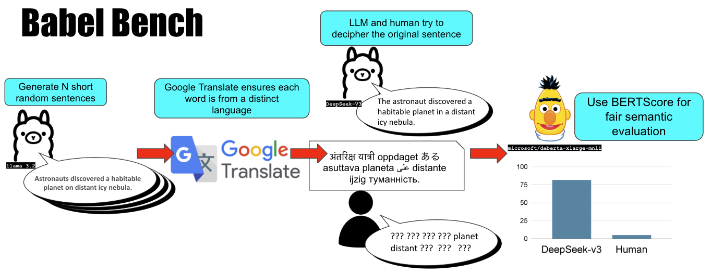

# Babel Benchmark: Hard for Humans, Easy for AI

## Overview

### Can you decipher the following: Der 迅速な коричневый 狐 skáče över собаку leniwy hund

The **Babel Benchmark** is a benchmark designed to demonstrate the **superhuman multilingual capabilities** of AI language models compared to humans. It challenges participants to decipher sentences where **each word is written in a different language and native script**, showcasing the AI's ability to effortlessly navigate across dozens of languages and writing systems — a task no human can achieve.

This project highlights a critical point: **language is AI's natural habitat**. While AI may struggle to interact with the physical world, it thrives in the domain of **text-based communication**. The Babel Test makes it undeniably clear that **AI has surpassed human capabilities in language comprehension**.

---
## Babel Benchmark Diagram



## Methodology

The Babel Benchmark uses a multi-step process to generate multilingual sentences and evaluate AI language models' performance in reconstructing the original English sentence. Here's how it works:

### 1. Sentence Generation

A base English sentence is generated randomly, ensuring it is diverse and unique. The generation process uses an AI language model to create sentences that vary in theme, structure, and vocabulary.

Example:

> **Base Sentence:** The quick brown fox jumps over the lazy dog.

### 2. Multilingual Encoding Using Google Translate

Each word in the base sentence is translated into a **random language** using Google Translate, ensuring that the translation uses the **native script** of the target language. No two consecutive words are from the same language.

Example:

> ### Multilingual Sentence
>
> **Base Sentence:** The quick brown fox jumps over the lazy dog.
> **Step 1:** Translate each word into a different language:
>
> - "The" -> "Der" (German)
> - "quick" -> "迅速な" (Japanese)
> - "brown" -> "коричневый" (Russian)
> - "fox" -> "狐" (Chinese)
> - "jumps" -> "skáče" (Czech)
> - "over" -> "över" (Swedish)
> - "the" -> "собаку" (Ukrainian)
> - "lazy" -> "leniwy" (Polish)
> - "dog" -> "hund" (Norwegian)
>
> ### Final Multilingual Sentence: Der 迅速な коричневый 狐 skáče över собаку leniwy hund

### 3. AI Model Reconstruction

The multilingual sentence is presented to an AI model, which is tasked with translating it back into the original English sentence. The model's output is evaluated against the base sentence.

### 4. Evaluation Using BERTScore

The reconstructed sentence from the AI model is compared to the original English sentence using [BERTScore](https://github.com/Tiiiger/bert_score), a state-of-the-art evaluation metric that measures **semantic similarity** between sentences. For this benchmark, we use the **"microsoft/deberta-xlarge-mnli"** model to ensure a high-quality semantic evaluation.

BERTScore provides a score out of 100, indicating how well the AI model reconstructed the original meaning:

- **Precision:** Measures how much of the model's output matches the original.
- **Recall:** Measures how much of the original sentence is captured by the model.
- **F1 Score:** A balance between precision and recall.

The score is calculated as follows:

```python
# Calculate BERTScore
P, R, F1 = score([" ".join(predicted_sentence)], [" ".join(original_sentence)], lang="en", rescale_with_baseline=True, model_type="microsoft/deberta-xlarge-mnli")
bert_f1 = max(F1.mean().item() * 100, 0.0)
total_bert_score += bert_f1
```

## Why This Test Matters

Language is **core to human intelligence** and civilization. For centuries, mastery of multiple languages has been considered a sign of intellectual achievement. The Babel Test flips this narrative on its head, proving that AI has **fundamentally surpassed humans** in this domain.

This benchmark is designed to challenge the assumption that human general intelligence surpasses AI across all domains. The Babel Benchmark demonstrates that **in the domain of language comprehension, AI has already achieved superhuman performance**. This is similar to other benchmarks like **ARC\_AGI** that highlight human reasoning capabilities, but here, the implications are reversed: **AI vastly outperforms humans** in this task.

### Key Points:

- **No human alive** can speak, read, and write fluently in hundreds of languages.
- Even the most accomplished polyglots are **specialists**, knowing a handful of languages at best. In contrast, **AI is a generalist** in language, capable of understanding \*\*dozens\*\* of languages, dialects, and scripts.
- The test highlights **AI’s ability to synthesize meaning across diverse linguistic inputs**, something that is **impossible for any human** to achieve without assistance.

The Babel Test underscores that **text is AI’s native habitat**. Humans may argue that AI lacks physical-world understanding, but in the **realm of language**, **AI is unmatched**. This test makes that point in a way that is **impossible to dismiss**.

---

## How to Use This Test

### Running the Test

1. **Generate a Base Sentence**: Use the provided script to create random English sentences.
2. **Translate Each Word**: The script will use Google Translate to convert each word into a different language.
3. **Present the Multilingual Sentence**: The script will present the multilingual sentence to the AI model.
4. **Evaluate the AI Model**: The AI model’s output is evaluated against the original English sentence using BERTScore.

### Tools

- **Python Scripts** for generating base sentences and converting them to multilingual versions.
- **Google Translate API** to handle the translations.
- **BERTScore** to evaluate the semantic similarity between the original and reconstructed sentences.

---

## Conclusion

The **Babel Test** is more than a fun puzzle—it’s a **wake-up call**. It highlights the areas where **AI is already superhuman**, and it forces us to confront the fact that **language is no longer an exclusively human domain**.

While humans may continue to hold an advantage in physical-world understanding, **text is the natural habitat of language models**. This test demonstrates that, in the domain of language, **AI has achieved a level of general intelligence that humans cannot match**.

The challenge is out there: **Can any human score higher than the llama3.2?**

Let's redefine what it means to be intelligent in the world of text.

---

## Licensing

This project is licensed under the MIT License. Feel free to use and modify it to create your own benchmarks, games, or research projects.

